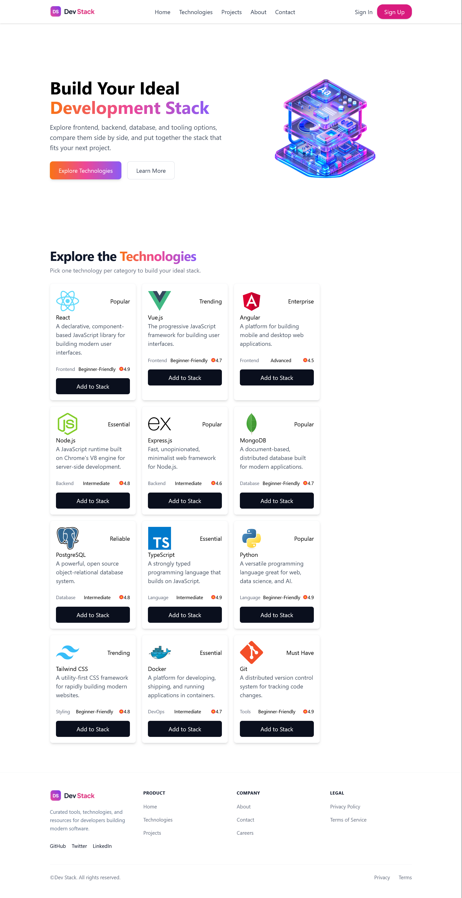

# DevStack — Technology Stack Builder

A modern web app to explore and build your ideal development stack. Browse curated technologies, compare them side by side, and save your favorites.

# Features

-  Browse 12+ curated technologies (React, Vue, Node.js, PostgreSQL, and more)
-  Filter-friendly badges (Popular, Trending, Essential, Enterprise)
-  Ratings & difficulty levels
-
-  Toast notifications via react-toastify
- Fully responsive — mobile, tablet, desktop
- Browse development technologies
- Build a personalized technology stack
- Add and remove technologies dynamically

#  Technologies Used
React
TypeScript
Vite
Tailwind CSS
React Toastify
JSON

##  Live Demo

- GitHub Repo :[@abdussamad99](https://github.com/abdussamad99)
- Versel Live Demo link : https://dev-stack-rho-seven.vercel.app/

